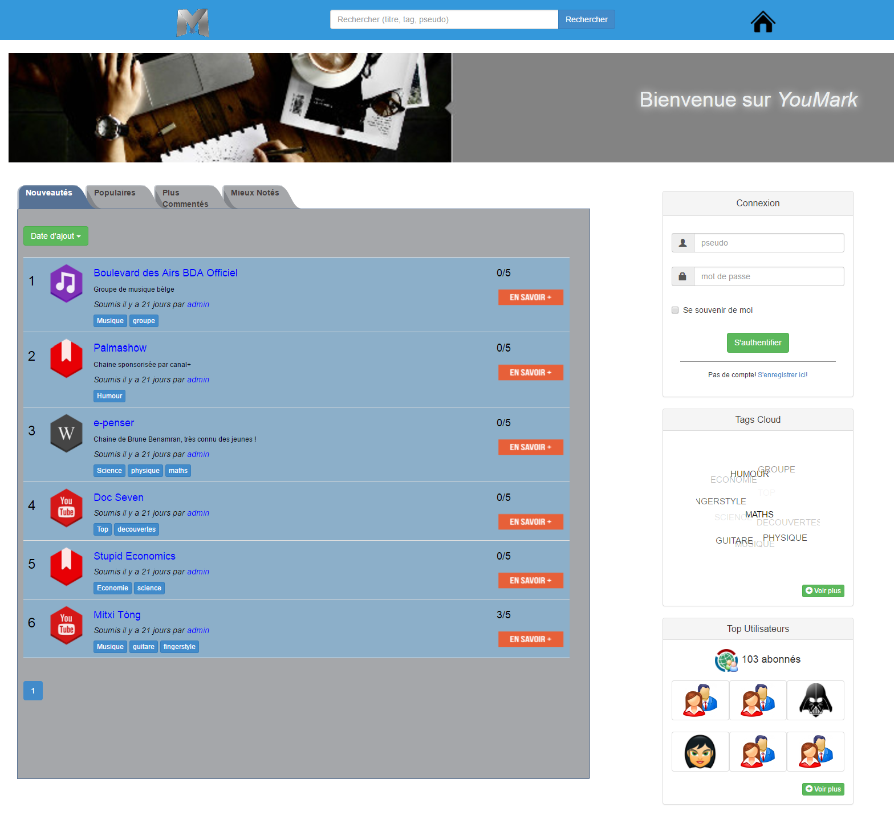

Realization: Youtube channels sharing website

Used tools: HTML, CSS, PHP, Bootstrap (bootsnip), Javascript

Please kindly notice that the website was created during my third year of bachelor. We were a team of 4 people and had (at the time) written classes and comments in French.

Objective:

We had to design a useful and easy-to-use Social Bookmarking mini-tool.

We chose to work on the design of a website to enrich and expand our knowledge in the field of the Web. Moreover, as this project required a long process of reflection, we knew that it would be of great help in our future reflection and in our professional future.

See our report for more information.

Personal note: I think we did an amazing work! We grew from our previous project, specially in term of writting. It is understandable for someone that have not knowledge in computer science. The report shows a real reflection, we implemented a lot of cool features! I am currently reviewing that 2 years later, and I am impressed with what we did.
